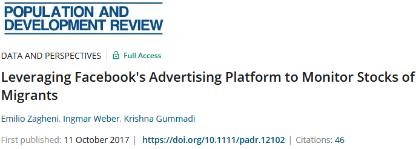

```{r setup, include = FALSE}
options(htmltools.dir.version = FALSE)
```


```{r xaringan-themer, include = FALSE, warning = FALSE}
library(xaringanthemer)
style_mono_accent(
  base_color = "#1c5253",
  header_font_google = google_font("Josefin Sans"),
  text_font_google   = google_font("Montserrat", "300", "300i"),
  code_font_google   = google_font("Fira Mono")
)
```

# Content

1. Teaching Web Scraping
  + Curriculum
  + Issues
  + Approach
2. Developments in Web Scraping
3. Suggestions
4. Conclusion

---

# Experience

- Teaching primers and one-day workshops on web scraping
  - postgraduate level and faculty
- Workshops based on R
- Participants with basic/intermediate programming skills

---

# Curriculum

```{r curriculum, echo = FALSE, eval = TRUE, warning = FALSE, message = FALSE, fig.width = 10, fig.height = 6, dpi = 300}
library(tidyverse)
library(lubridate)

curriculum.df <- tibble(
  task = factor(
    c("Introduction", "Web technologies", "Application in R", "Break",
      "Application in R", "Advanced topics", "Legalities & ethics"),
    levels = c("Introduction", "Web technologies", "Application in R", "Break",
               "Advanced topics", "Legalities & ethics")),
  start = c(hm("9:00"), hm("9:30"), hm("11:00"), hm("12:00"), hm("13:00"), 
            hm("15:00"), hm("16:30")),
  end = c(hm("9:30"), hm("11:00"), hm("12:00"), hm("13:00"), hm("15:00"), 
          hm("16:30"), hm("17:30")),
  pause = c(0, 0, 0, 1, 0, 0, 0))

ggplot(curriculum.df, aes(x = fct_rev(task), xend = fct_rev(task), 
                          y = start, yend = end, colour = factor(pause))) + 
  geom_segment(size = 10, show.legend = FALSE) + 
  coord_flip() +
  labs(x = "", y = "") +
  scale_y_time(labels = function(x)stringr::str_sub(format(x), end = -4L)) +
  theme_xaringan(background_color = "#FFFFFF",
                 text_font_size	= 60) +
  scale_colour_manual(values = c("#1c5253", "#cccccc"))
```

---

# Issues

.pull-left[
- Time constraints (max. 1h on legalities/ethics)
- Multiple third-parties
  - Website operator
  - Users
- Many cases & tools
  - Social media
  - Corporate data
  - APIs, websites...
]

.pull-right[
```{r stakeholder, eval = TRUE, echo = FALSE, out.width = "80%"}
DiagrammeR::grViz("
digraph stakeholders {

graph [overlap = true, fontsize = 10, fontname = Montserrat]

node [shape = box]
nodeA [label = 'Researcher'];
nodeB [label = 'Web\noperator'];
nodeC [label = 'User']

nodeA->nodeB [label='Legalities', fontsize = 7];
nodeA->nodeC [label=' Ethics', fontsize = 7]
}")
```
]

---

# Approach

> "Big data? Cheap. Lawyers? Not so much."

.right[<font size="3">— Pete Warden (cit. in Mitchell 2015. Web Scraping with Python) </font size>]

- Inform participants (ToS, non-reactive data, "friendly scraping")
- Contact universities' ethics commission
- Introduce tools (e.g. `robotstxt`)
- Discuss participants' research

---

# Developments in Web Scraping

.pull-left[

#### First stage
- Abundance of data
- No professional standards

#### Second stage
- Access limited by companies
- Professional deliberation

#### Third stage
- Common standards & rules

.left[.footnote[<font size="3">(cf. Bruns 2019, Puschmann 2019)</font size>]]

]

.pull-right[
```{r developments, eval = TRUE, echo = FALSE, out.width = "50%"}
DiagrammeR::grViz("
digraph developments {

graph [overlap = true, fontsize = 10, fontname = Montserrat]

node [shape = box]
nodeA [label = 'Wild west'];
nodeB [label = 'APIcalypse'];
nodeC [label = 'Legal & ethical\nreflections']

nodeA->nodeB
nodeB->nodeC
}")
```
]

---

# Suggestions

.pull-left[
- Case studies
- Guidelines
- History of web scraping <font size = "3">(APIcalypse, CambridgeAnalytica)</font size>
]

.pull-right[

#### Nowcasting migrant stocks

```{r facebook_ad, eval = TRUE, echo = FALSE}

```

- Rewards & risks
- ToS (Facebook)
- Users (i.e. migrants)
]

---

# Conclusion

.pull-left[
#### Issues
- Limited time
- (Few) guidelines <font size = "3">(but see: Salganik 2019)</font size>

#### Objectives
- Teaching materials
  - Collection of case studies
  - Discussion 

]

.pull-right[
</br></br></br></br></br></br></br></br></br></br></br></br>
[`r fontawesome::fa(name = "link")` Slides:  https://bit.ly/3CUuU4m](https://fabianfox.github.io/BigDataBigProblems/)

[`r fontawesome::fa(name = "home")` https://fguelzau.rbind.io](https://fguelzau.rbind.io)

[`r fontawesome::fa(name = "paper-plane")` fabianguelzau@hu-berlin.de](mailto:fabianguelzau@hu-berlin.de)]

---

# Bibliography

**Bruns, A.** (2019) After the ‘APIcalypse’: social media platforms and their fight against critical scholarly research, Information, Communication & Society, 22:11, 1544-1566, DOI: 10.1080/1369118X.2019.1637447 

**Mitchell, R.** (2015) Web scraping with python. Collecting Data from the modern web, Sebastopol: O'Reilly.

**Puschmann, C.** (2019) An end to the wild west of social media research: a response to Axel Bruns, Information, Communication & Society, 22:11, 1582-1589, DOI: 10.1080/1369118X.2019.1646300

**Salganik, M.J.** (2018) Bit by bit. Social research in the digital age, Princeton: Princeton University.

**Zagheni, E., Weber, I. and K. Gummadi** (2017) Leveraging facebook's advertising platform
to monitor stocks of migrants, Population and Development Review, 43:4, 721-732, 10.1111/padr.12102